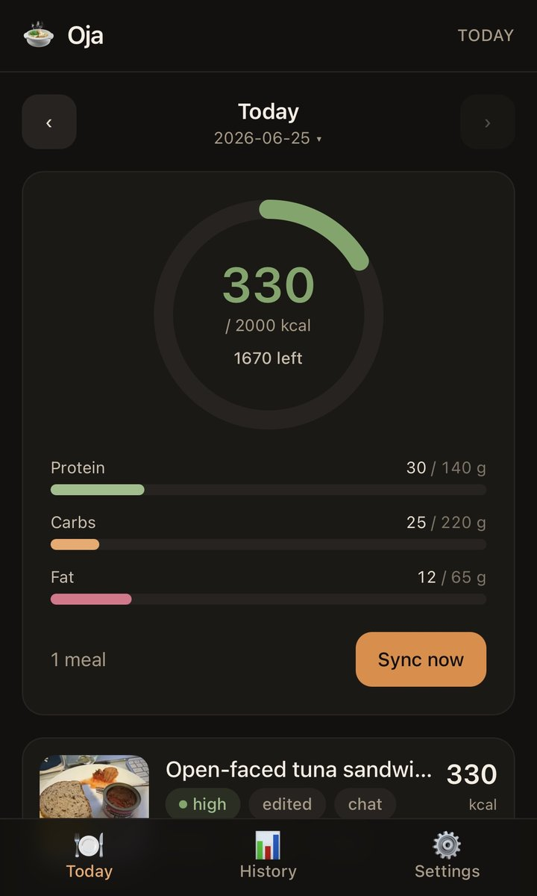
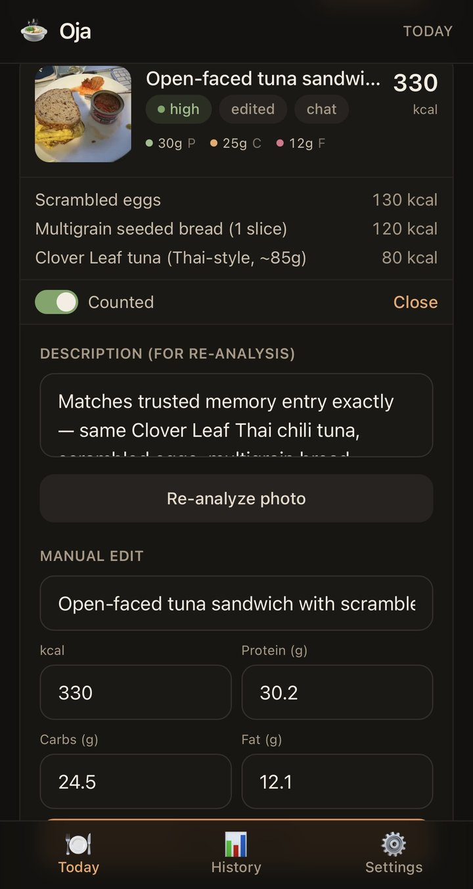
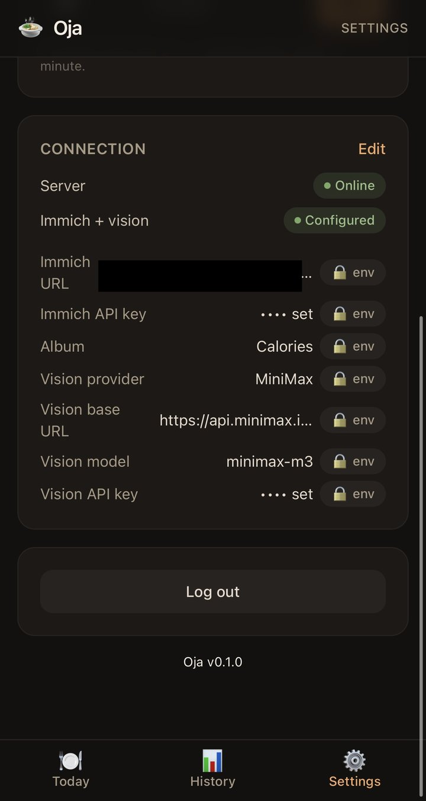

# Oja

**Your Immich food photos, turned into a calorie diary — privately, with the AI model of your choice.**

Oja is a self-hosted AI calorie tracker that watches an [Immich](https://immich.app) album for
food photos, runs each new photo through a vision LLM, and logs an estimate of the dish, calories,
and macros. Drop a photo of your meal into the album from your phone's auto-backup and it shows up
on your dashboard. Bring-your-own-LLM, privacy-first, and a companion to the Immich server you
already run.

[](LICENSE)
[](docker-compose.yml)
[](https://docs.ojatracker.com)

📖 **Full documentation → [docs.ojatracker.com](https://docs.ojatracker.com)**

---

## Features

- **Immich-native** — points at an album you already auto-backup into; no new app to remember.
- **Configure in the browser** — a built-in [setup wizard](#setup) lets you enter your Immich URL +
  key, pick the album, and choose an LLM provider + key + model with no `.env` file. Env vars still
  work and lock the field when set (great for headless deploys).
- **Bring-your-own-LLM** — broad provider support: OpenAI, OpenRouter, MiniMax, Groq, Together,
  DeepInfra, native Anthropic & Google Gemini, or a fully **local, $0** Ollama / LM Studio. Your photos
  and keys never leave your infrastructure unless you choose a cloud model. See
  [Supported LLM providers](#supported-llm-providers).
- **Auto + manual sync** — polls the album on an interval, with a "Sync now" button when you're impatient.
- **Daily dashboard** — today's total vs your goal, macro bars, and per-meal cards with a per-item breakdown.
- **Editable & correctable** — include/exclude a meal from the day, edit it by hand, re-analyze a photo
  (optionally with a corrected description), or just **chat** ("it was a double portion, no rice").
- **Personal food memory** — past meals (your corrected ones first) are fed back as priors, so recurring
  meals converge on *your* numbers over time.
- **History** — intake-vs-goal over time, with a chart.
- **Single-file by default** — zero-setup SQLite, or point it at Postgres when you outgrow that.
- **One container** — a single multi-stage Docker image serves both API and UI.

## Screenshots

<p align="center">
  
</p>

| AI re-analysis & personal food memory | Bring-your-own Immich + LLM |
|:--:|:--:|
|  |  |

---

## Quick start

You need a running **Immich** server and a **vision LLM** (cloud or local — see
[Supported LLM providers](#supported-llm-providers)).

### With an AI agent (paste this prompt)

Hand this to an agentic AI (Claude Code, Cursor, ChatGPT with tools) — it fetches the guide, asks for your keys, and sets everything up:

> Set up **Oja** on this machine (a self-hosted calorie tracker for Immich). Fetch `https://raw.githubusercontent.com/sarworld/Oja/main/docs/public/agent-install.md` and follow it exactly. Ask me for my Immich URL, Immich API key, and an LLM API key (default the model to Anthropic `claude-haiku-4-5`); generate the app password and session secret yourself. Run with Docker, verify `http://localhost:8462/api/health` shows `"configured": true`, then give me the URL and login password.

It follows [`docs/public/agent-install.md`](docs/public/agent-install.md).

### One command (headless — for scripts, CI, or AI agents)

Pass everything as env vars and Oja boots fully configured (no wizard). Env values are **locked**
in the UI, ideal for reproducible deploys:

```bash
docker run -d --name oja -p 8462:8462 -v oja-data:/app/data \
  -e APP_PASSWORD="$(openssl rand -hex 12)" -e SESSION_SECRET="$(openssl rand -hex 32)" \
  -e IMMICH_URL="https://immich.example.com" -e IMMICH_API_KEY="<key>" -e IMMICH_ALBUM="Food" \
  -e VISION_PROVIDER="anthropic" -e VISION_BASE_URL="https://api.anthropic.com" \
  -e VISION_API_KEY="<key>" -e VISION_MODEL="claude-haiku-4-5" \
  ghcr.io/sarworld/oja:latest
```

> `ghcr.io/sarworld/oja` (multi-arch) is published on each tagged release. Until the first release,
> use the Compose flow below. Full headless guide: **docs → Getting started → One-command setup**.

### From source (Compose)

```bash
# 1. Get the code
git clone https://github.com/sarworld/Oja.git
cd oja

# 2. Configure — pick ONE:
#    (a) zero-config: just set a login, run, and finish setup in the browser
cp .env.example .env
#    edit .env — set APP_PASSWORD and SESSION_SECRET (Immich + vision can be
#    left blank and entered in the setup wizard on first run), OR
#    (b) pre-fill everything: also set IMMICH_URL, IMMICH_API_KEY,
#    IMMICH_ALBUM, VISION_PROVIDER, VISION_BASE_URL, VISION_API_KEY, VISION_MODEL

# 3. Run
docker compose up -d
```

Then open **http://localhost:8462** and log in with your `APP_PASSWORD`. If Immich/vision aren't
configured yet, Oja drops you into the **setup wizard** (see [Setup](#setup)). Once configured, drop a
food photo into your Immich album (or hit **Sync now**).

Your database lives in `./data` (mounted into the container), so your diary survives restarts and
upgrades.

---

## Setup

You don't need an `.env` file to configure Oja. On first run, if Immich or the vision model aren't
configured, Oja routes you to a **setup wizard** in the browser:

1. **Immich** — enter your Immich **base URL** and **API key**, then click **Test & load albums**.
   Oja verifies the connection and lets you **pick your album** from a dropdown.
2. **Vision** — choose an **LLM provider** from the preset dropdown (it auto-fills the base URL and
   suggests vision-capable models), paste your **API key**, pick a **model**, and click **Test** for a
   tiny round-trip check.
3. **Save** — and you're on the dashboard.

You can return to it any time from **Settings → Connection**. All of this maps to the same config
fields as the env vars below, so you can configure entirely in the UI, entirely via `.env`, or mix.

**Environment vars still work and take precedence.** When a field is set by an environment variable,
the wizard renders it **read-only and "set by environment"** (locked). That makes env vars ideal for
**headless / managed / reproducible deploys** where you want config baked into the image or compose
file, while the UI remains available for everything you didn't pre-set. Secrets you enter (API keys)
are stored server-side and **never returned to the browser** in plaintext.

---

## Configuration

Every Immich and vision setting can be provided **either** via environment variables (see
[`.env.example`](.env.example)) **or** via the [setup wizard](#setup) in the UI — so the "Required"
column below means *required before Oja is usable*, not *required at boot*. The only values that are
genuinely env-only are `APP_PASSWORD`, `SESSION_SECRET`, `PORT`, `DATABASE_URL`, and `TZ`. When an
environment variable **is** set, the matching UI field is **locked** ("set by environment").

| Var | Required | Default | Set via UI? | Notes |
|---|:---:|---|:---:|---|
| `PORT` | no | `8462` | no | HTTP port |
| `APP_PASSWORD` | **yes** | — | no | single login password for the UI |
| `SESSION_SECRET` | **yes** | — | no | secret used to sign the session cookie (use a long random string) |
| `DATABASE_URL` | no | `sqlite:./data/oja.db` | no | set a `postgres://…` URL to use Postgres instead of SQLite |
| `IMMICH_URL` | **yes** | — | yes | e.g. `https://immich.example.com` |
| `IMMICH_API_KEY` | **yes** | — | yes | Immich API key (see below) |
| `IMMICH_ALBUM` | **yes** | `Food` | yes | album **name or id** Oja watches |
| `VISION_PROVIDER` | no | `openai` | yes | adapter: `openai` (OpenAI-compatible), `anthropic`, or `gemini` |
| `VISION_BASE_URL` | no | `https://api.openai.com/v1` | yes | base URL for OpenAI-compatible providers |
| `VISION_API_KEY` | **yes** | — | yes | key for your vision provider |
| `VISION_MODEL` | no | `gpt-4o-mini` | yes | any vision-capable model |
| `POLL_INTERVAL_MINUTES` | no | `90` | yes | how often to auto-poll the album; `0` disables auto-poll |
| `TZ` | no | `UTC` | no | timezone used for day boundaries (e.g. `America/Toronto`) |

> Fields in the **Set via UI?** column are optional in `.env` — leave them blank and enter them in the
> setup wizard instead. Anything you do set in `.env` is locked in the UI.

---

## Supported LLM providers

Oja supports **most LLM models** through three adapters, selected by `VISION_PROVIDER`
(`vision_provider` in the UI):

- **`openai`** — any **OpenAI-compatible** `/chat/completions` endpoint with `image_url` input. This
  one value covers the large majority of providers below (and any other OpenAI-compatible gateway,
  including self-hosted vLLM).
- **`anthropic`** — Claude's **native** Messages API (image content blocks).
- **`gemini`** — Google's **native** Generative Language API (`inlineData`).

The setup wizard ships these as presets (auto-filling the base URL and suggesting models). Pick whatever
you have a key for — and note that **Ollama** and **LM Studio** give you a fully **local, $0, private**
option where your photos and keys never leave your machine.

| Provider | `provider` | `base_url` | Example vision model | Notes |
|---|---|---|---|---|
| **OpenAI** | `openai` | `https://api.openai.com/v1` | `gpt-4o-mini` | Good, cheap default |
| **OpenRouter** | `openai` | `https://openrouter.ai/api/v1` | `openai/gpt-4o-mini` | One key, gateway to Anthropic / Gemini / Llama / etc. |
| **MiniMax** | `openai` | `https://api.minimax.io/v1` | `MiniMax-VL-01` | |
| **Groq** | `openai` | `https://api.groq.com/openai/v1` | `meta-llama/llama-4-scout-17b-16e-instruct` | Fast hosted inference |
| **Together** | `openai` | `https://api.together.xyz/v1` | `meta-llama/Llama-4-Scout-17B-16E-Instruct` | |
| **DeepInfra** | `openai` | `https://api.deepinfra.com/v1/openai` | `meta-llama/Llama-3.2-11B-Vision-Instruct` | |
| **Ollama** (local) | `openai` | `http://host.docker.internal:11434/v1` | `llava` | **Local, free, private.** `ollama pull llava` first; any key (e.g. `ollama`) |
| **LM Studio** (local) | `openai` | `http://host.docker.internal:1234/v1` | `llava` | **Local, free, private.** Start its local server; any key works |
| **Anthropic** (native) | `anthropic` | *(n/a)* | `claude-3-5-sonnet-latest` | Native Messages API |
| **Google Gemini** (native) | `gemini` | *(n/a)* | `gemini-1.5-flash` | Native Generative Language API |
| **Custom** | `openai` | *your endpoint* | *your model* | Any other OpenAI-compatible endpoint (e.g. self-hosted vLLM) |

A few examples as `.env` blocks (the wizard sets the same fields):

**OpenAI** — a good, cheap default:

```env
VISION_PROVIDER=openai
VISION_BASE_URL=https://api.openai.com/v1
VISION_MODEL=gpt-4o-mini
VISION_API_KEY=sk-...
```

**OpenRouter** — one key, gateway to Anthropic / Gemini / Llama and many more:

```env
VISION_PROVIDER=openai
VISION_BASE_URL=https://openrouter.ai/api/v1
VISION_MODEL=openai/gpt-4o-mini
VISION_API_KEY=sk-or-...
```

**Local Ollama (llava)** — fully local, $0, private, no cloud:

```env
# Ollama exposes an OpenAI-compatible API at /v1
VISION_PROVIDER=openai
VISION_BASE_URL=http://host.docker.internal:11434/v1
VISION_MODEL=llava
VISION_API_KEY=ollama
```

**Anthropic (native)** — uses the Messages API, so no base URL is needed:

```env
VISION_PROVIDER=anthropic
VISION_MODEL=claude-3-5-sonnet-latest
VISION_API_KEY=sk-ant-...
```

> Tips: model ids and base URLs change over time — check your provider's docs for the current
> vision-capable model. Local models are cheaper and private but generally less accurate than hosted
> ones. For Ollama or LM Studio from inside Docker, use `host.docker.internal` (Linux: add it via
> `extra_hosts`) or your host's LAN IP.

---

## Getting an Immich API key

1. Open your Immich web UI and click your avatar → **Account Settings**.
2. Open the **API Keys** section and click **New API Key**.
3. Give it a name (e.g. `oja`) and create it. Copy the key — it's only shown once.
4. Put it in `.env` as `IMMICH_API_KEY`, and set `IMMICH_URL` to your Immich base URL.
5. Set `IMMICH_ALBUM` to the album you'll drop food photos into (its **name**, e.g. `Food`, or its id).

Oja proxies images through the server using this key, so the key is **never exposed to the browser**.

---

## Development

> AI assistance was used during development of this project. Code, design, and release decisions remain reviewed and maintained by the project author.

Oja is a TypeScript monorepo: an Express/Node backend in `server/` and a React + Vite frontend in `web/`.
Requires **Node 20+**.

Run the two dev servers in separate terminals:

```bash
# backend (http://localhost:8462)
cd server
npm install
cp ../.env.example .env   # fill in your values
npm run dev               # tsx watch, restarts on change

# frontend (Vite dev server, proxies /api to the backend)
cd web
npm install
npm run dev
```

Useful scripts (both packages):

```bash
npm run typecheck   # tsc --noEmit
npm run build       # server -> server/dist, web -> web/dist
npm test            # vitest (server: unit + supertest API; web: component tests)
```

---

## Support

Oja is free and open source (MIT). If it's useful to you and you'd like to help keep it
maintained, you can support development on
**[Patreon](https://patreon.com/sarworld)** — thank you! 🙏

To test the production image locally:

```bash
docker compose up --build
```

See [CONTRIBUTING.md](CONTRIBUTING.md) for more.

---

## Accuracy disclaimer

Calorie and macro numbers are **AI estimates from a photo**, not measurements. They can be wrong —
sometimes substantially — because portion size, hidden ingredients, oil, and cooking method are hard to
judge from an image. Treat Oja as a fast, low-friction *approximation* and correct meals when you can
(editing and chatting improve future estimates via food memory). Do not rely on it for medical or
clinical decisions.

## License

MIT — see [LICENSE](LICENSE). © 2026 Oja contributors.
